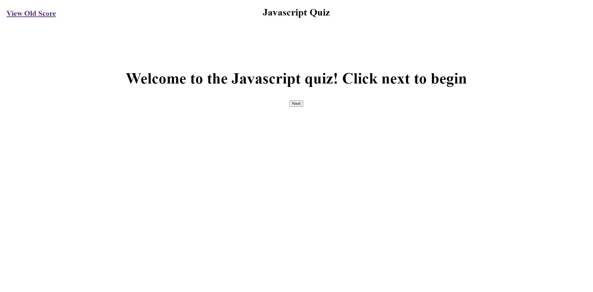
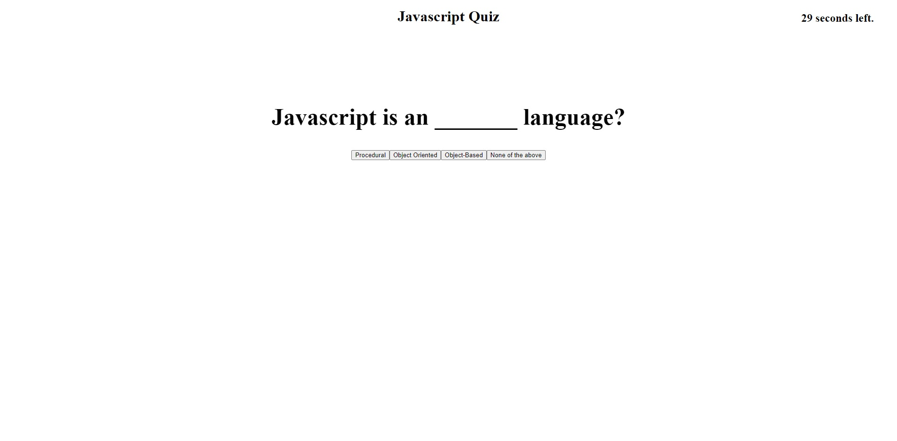
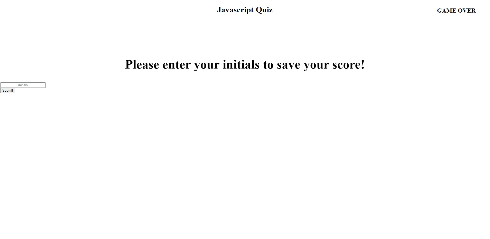
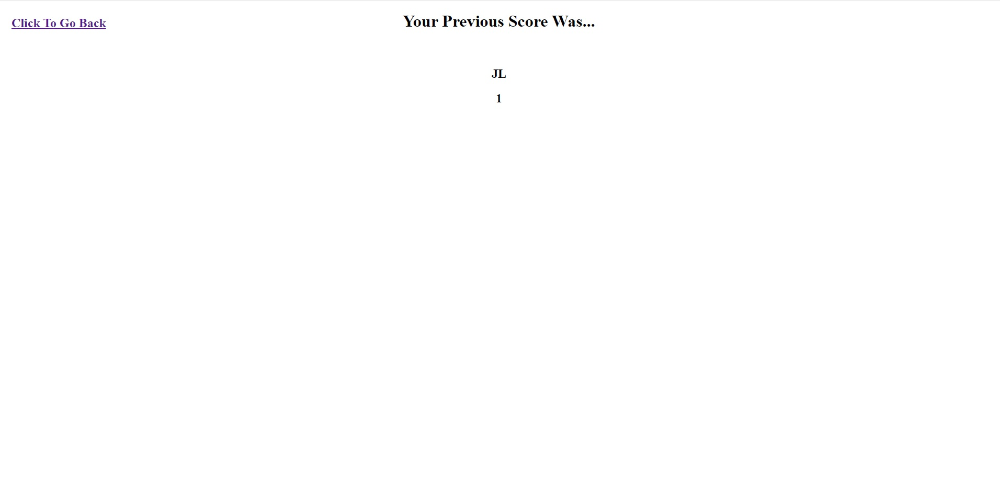

# javascript-quiz

## Description

This is a Javascript quiz! You're given five questions that you must answer in the given time. More questions can be added if needed in the scirpt.js file under the questionBank array!

The quiz is over when you complete the questions, or when you run out of time. You begin with 30 seconds, and each time you get a question wrong, you'll lose 5 seconds. When the game is over, you'll be given a score and be asked to put in your initials. You can view your previous score by clicking "View Old Score" at the top left of the home screen!

## Installation

https://rockojoe2.github.io/javascript-quiz/

You can either visit the website to take the Javascript quiz, or download it to your computer and open the index from there.

## Credits

UTA-VIRT-FSF-FT-06-2023-U-LOLC Repo in GitLab.

## License

MIT License

---